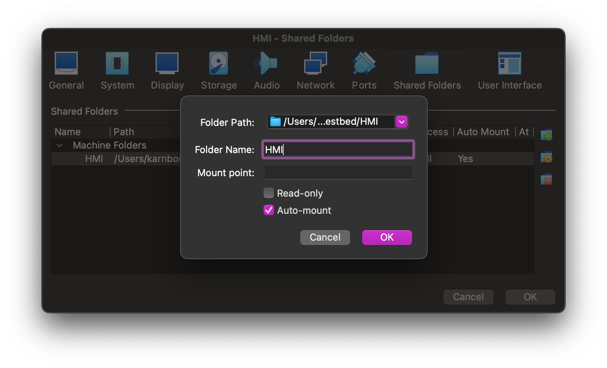

# Step 0: Setting up the Virtual Machines

There will be 5 virtual machines in the virtual testbed. Consists of:
* 2 Pfsense Router
* 2 Windows10 VMs
* 1 Kali Linux VM

The following section will give instruction on creating the virtual machines.

## Kali Linux
The setup instruction for Kali Linux on VirtualBox can be found on the Kali Linux official website, [here](https://www.kali.org/docs/virtualization/install-virtualbox-guest-vm/).

## Windows 10
The ISO image for Windows 10 can be downloaded [here](https://www.microsoft.com/en-gb/software-download/windows10ISO) (select the 64 bit).

To create a Windows10 VM, following these steps:

* Open VirtualBox
* Click New 
* In the ISO image field, select the ISO you downloaded.
* Keep clicking Next. But make sure you give it at least 2048MB base memory and 20GB virtual hard disk.
* Start the VM and let the Window installer run itself.
* Do the same step for the second Windows10 VM

One VM will be the HMI and one will be workstation

We will also want to create shared folder, so that the source file can be shared with the VMs.
We will mount Virtual_testbed > HMI to the HMI machine and Virtual_testbed > Workstation to the workstation machine
We can do this by:

* For each VM go to Settings > Shared Folders
* Add shared folder with the following settings for each machine. The folder path is your path to the Virtual_testbed source code folder.  
* Turn on the VM and click Devices > Insert Guest Additions CD Image

## Pfsense router
The ISO image for the router can be downloaded [here](https://www.pfsense.org/download/).
You must choose the options shown below.

To create a Pfsense router VM, following these steps:

* Open VirtualBox
* Click New 
* In the ISO image field, select the ISO you downloaded. And select the options specified below. 
* Keep clicking Next. But make sure you give it at least 1024MB base memory and 10GB virtual hard disk.
* Start the VM and follow the PFsense router installation wizard.
* Do the same step for the second Pfsense VM
