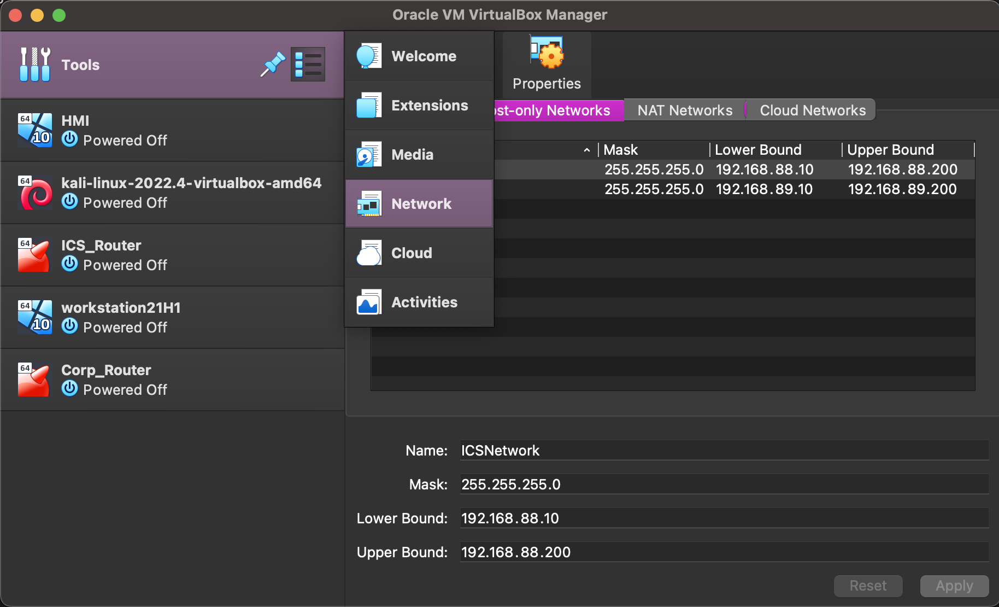
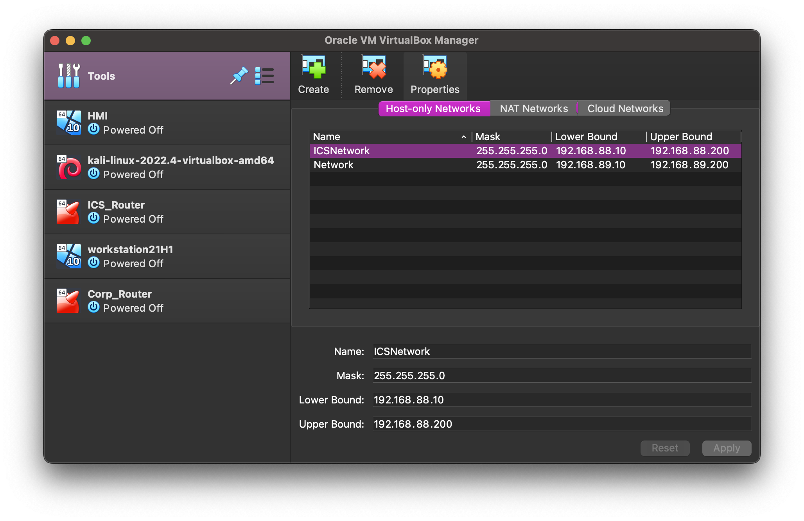
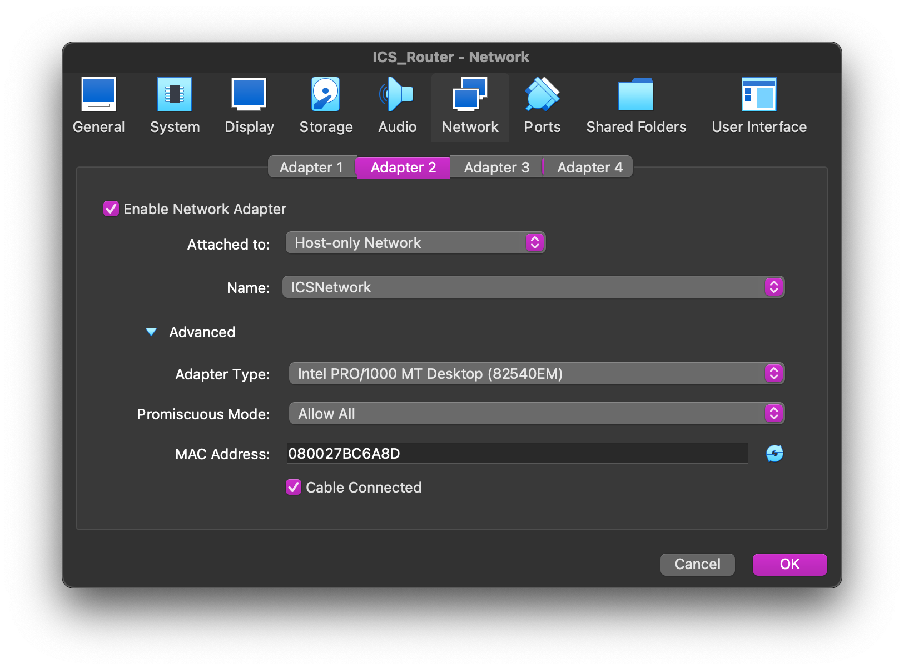
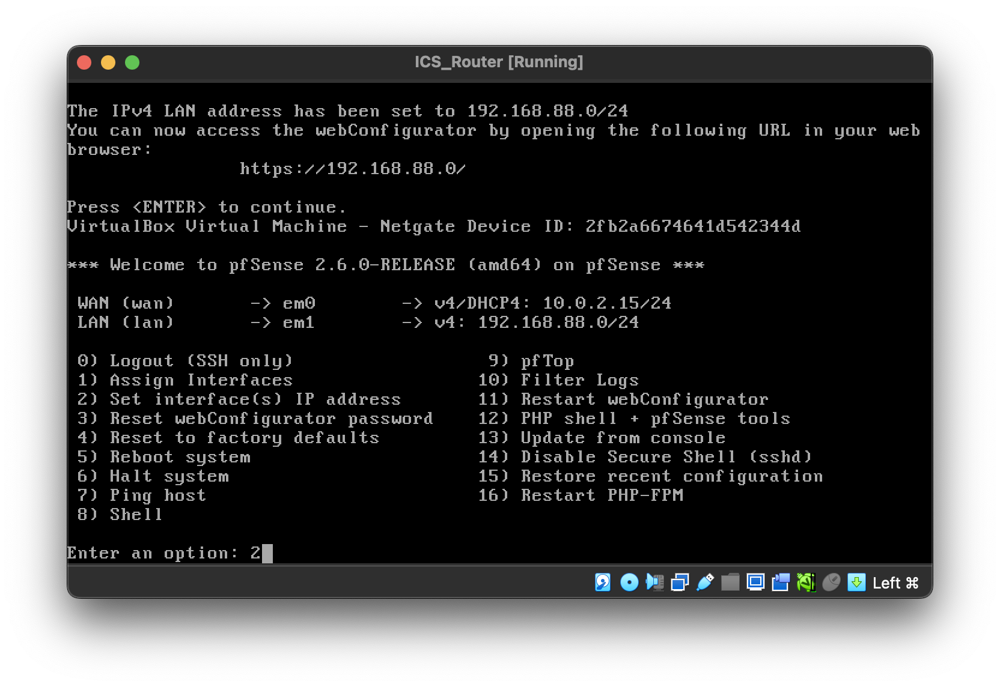
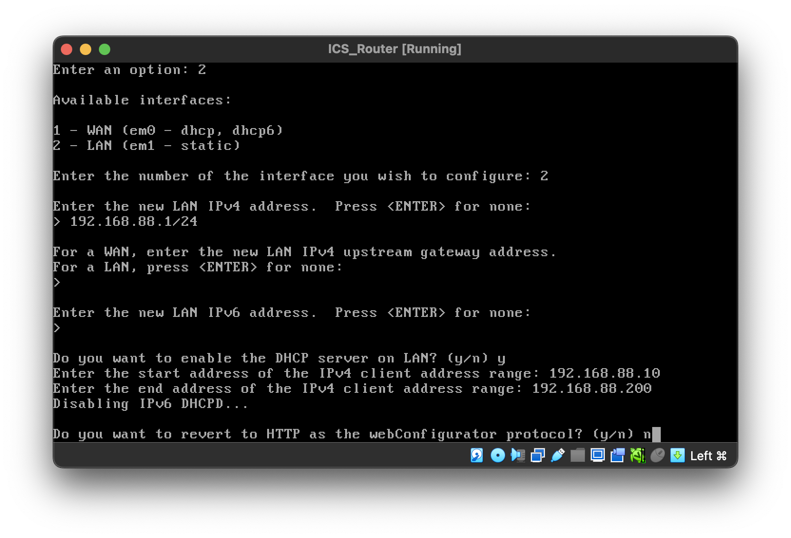
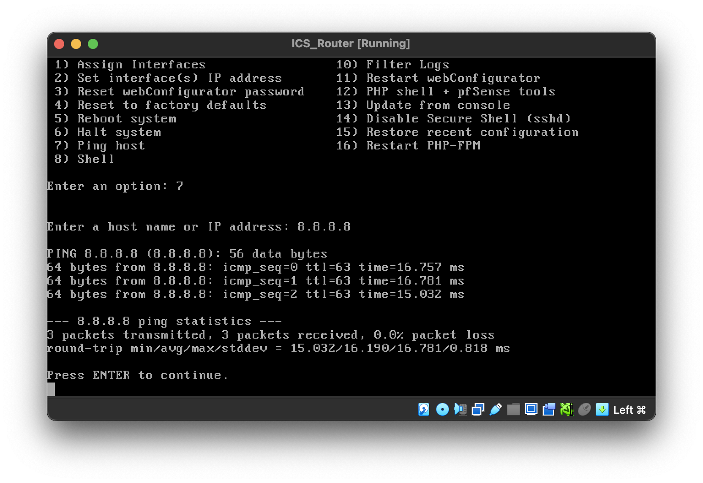

# Step 1: Setting up the Routers

The two Pfsense VM we created in step 0 will be the routers for ICS network and corporate network.
The setup for the two routers will only differ in some steps.

The steps to setting up the router is the followings:
* Open VirtualBox and go to Tools > Network. 
* Create two Host-only Networks with the following values. 
* Go to each Pfsense VM, click on Settings > Network > Adapter 2. (Make sure Adapter 1 is NAT)
* Enable network adapter and select the Host-only Network option.
* Attach the adapter to the host-only network for that router.  (ICS network for ICS router and corporate network for coporate router)
* Turn on the router, it will boot for a while.
* Once it is done. Select "Set Interface IP Address" 
* Follow the setting below. 
* For the ICS router, we assign 192.168.88.0/24
* For the corporate router, we assign 192.168.89.0/24
* To check whether the router is working, try ping some public host. 