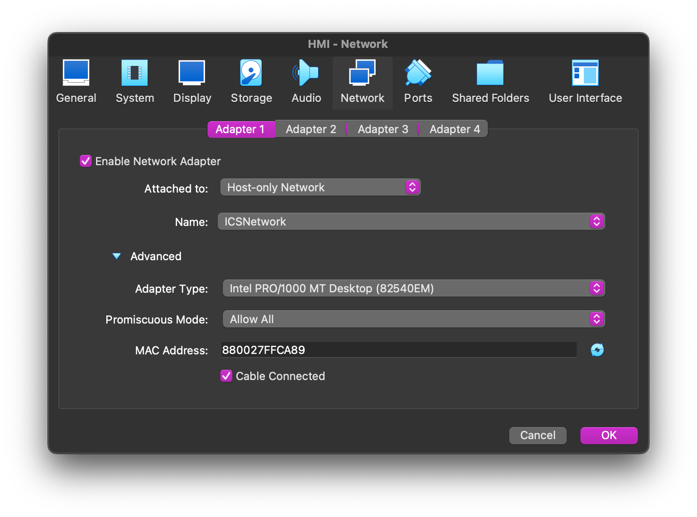
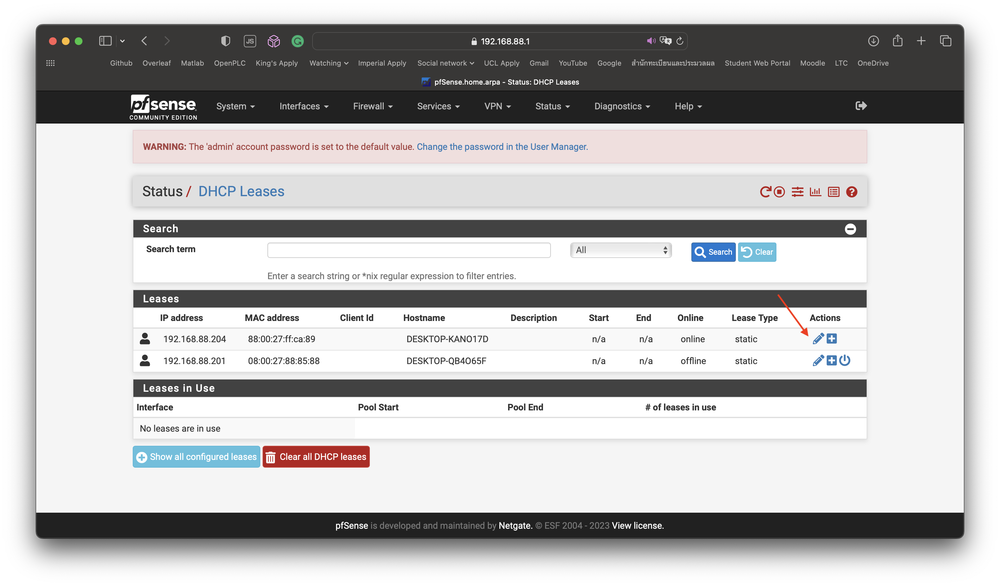
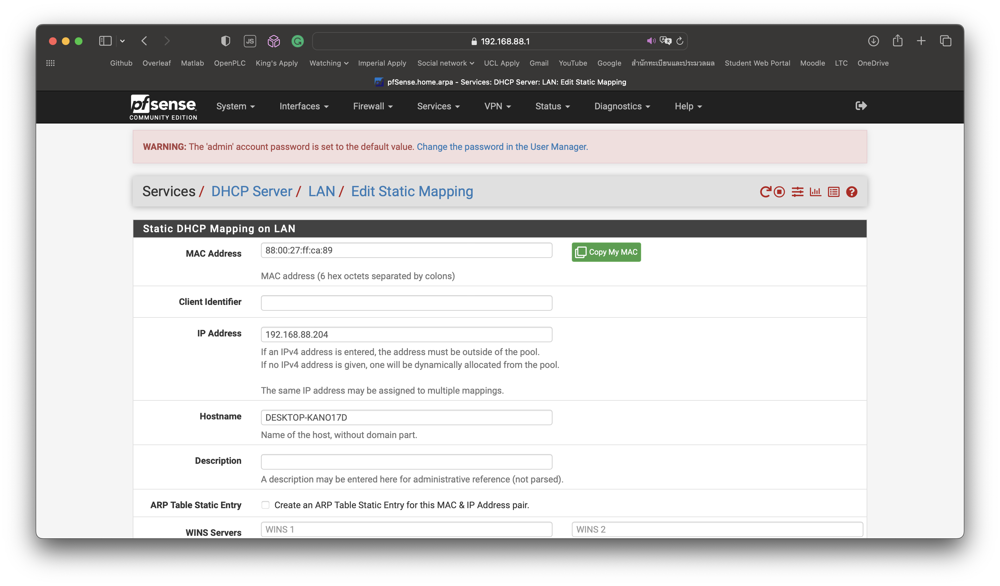

## Step 2: Configuring Static IP addresses for each machines

This step will be about setting up static IP for each VMs. We have two network, one ICS and one corporate. We want to set it up, so each network have the following attributes.

### The ICS network
* A human machine interface (Windows 10) at 192.168.88.204
* An engineering workstation (Windows 10) at 192.168.88.201
* A programmable logic controller (Docker) at 192.168.88.10
  (ignore for now)

### The corporate network
* An engineering workstation (the same one as in ICS) at 192.168.89.201
* An attacker machine (Kali Linux) at 192.168.89.203

The steps to get to the desired network structure is:

* In step 1, when we finished setting up the router, we should get an address for the webConfigurator portal. (ICS: 192.168.88.1 and Corp: 192.168.89.1)
* Open the webConfigurator portal of both routers.
* Login using username: admin, password: pfsense
* For every VMs, go to Setting > Network
* Change Adapter 1 from NAT to Host-only network, attach it to the network that VM belongs to.* 
* Turn on the VM
* In the webConfigurator, the VM should show up in Status > DHCP leases.
* Edit the device's static lease accoding to the IP given above.  

\* For the engineering workstation, enable 2 adapters, have one adapter attach to the ICS network and another to the corporate network.