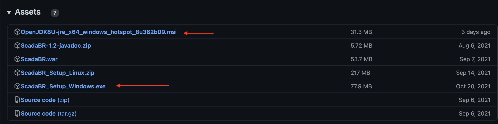
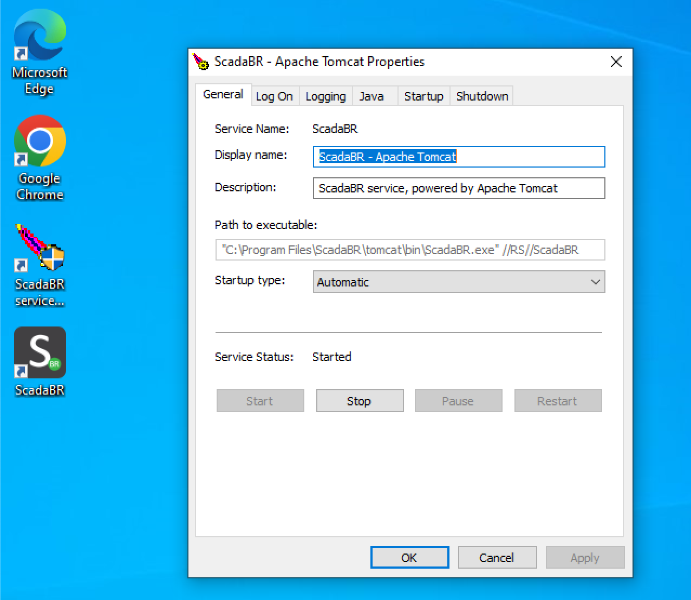
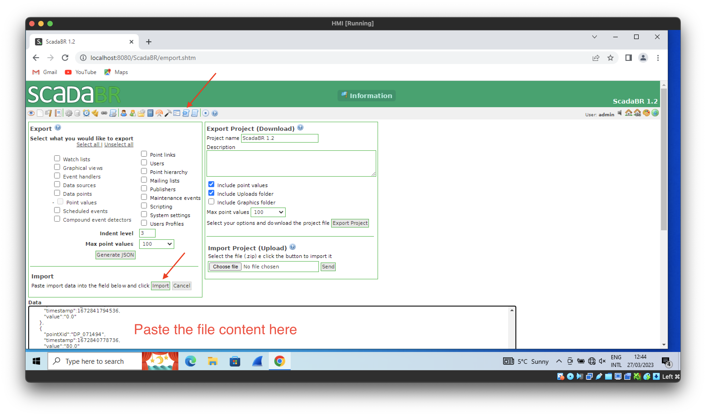
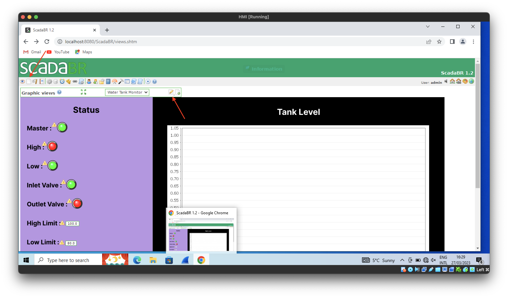
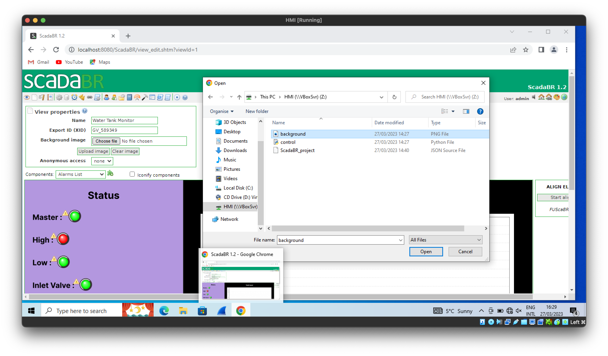
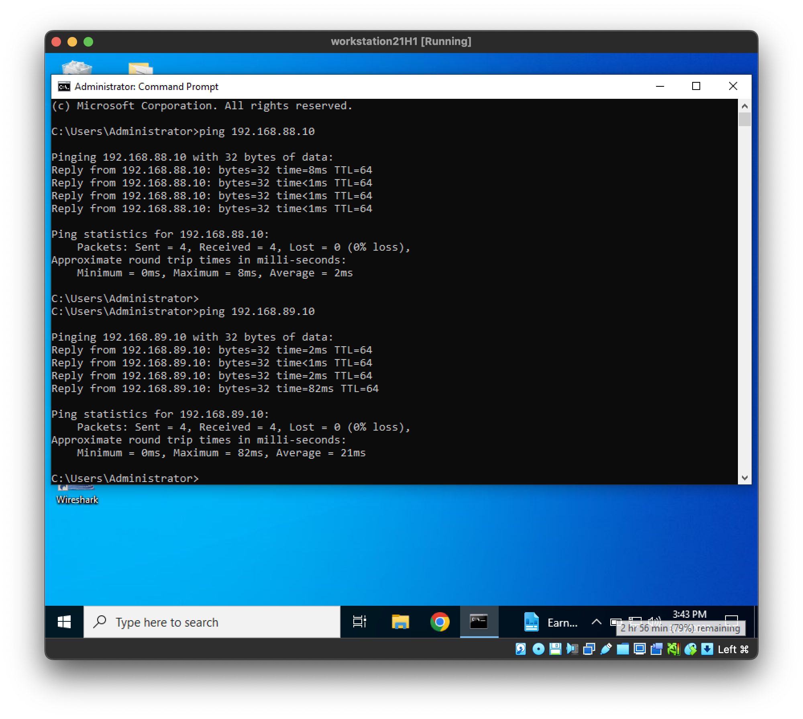

## Step 3: Setting up the HMI and the workstation

### Setup the HMI
Make sure you have access to the shared folder we made in step 0. The HMI has two important component: the process monitor and the control panel.

To set up the control panel, just install python on the HMI and call `pip install pymodbus`. Then whenever you want to run the control panel, just call "python control.py"

To set up the process monitor, follow these steps:
* Download OpenJDK and ScadaBR setup ([here](https://github.com/ScadaBR/ScadaBR/releases/tag/v1.2)). 
* Install OpenJDK first, then ScadaBR.
* Once installation is done, open ScadaBR service manager and make sure the service is started. 
* Open the ScadaBR application, login using username: admin, password: admin
* Go to "import/export" menu, dump the content of ScadaBR_project.json into the data field and click import. 
* Go to "Graphic Views" menu. If the background for monitor doesnt show up. Manually upload it.  

### Setup the workstation

Setting up the workstation is not complicated at all, just make sure you have connections to both network.  Then download open PLC editor from [here](https://openplcproject.com/download/). When everything is running, the PLC webserver should be available to you on 192.168.88.10:8080.