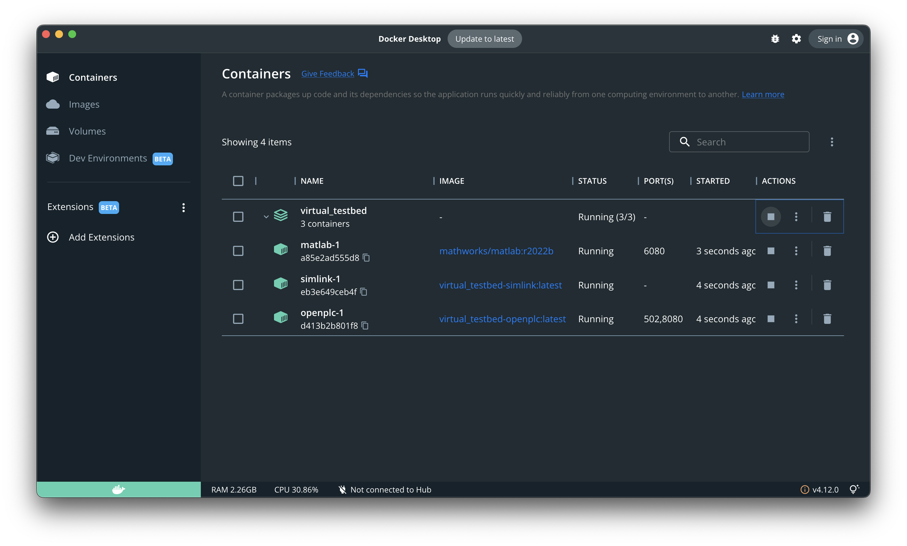
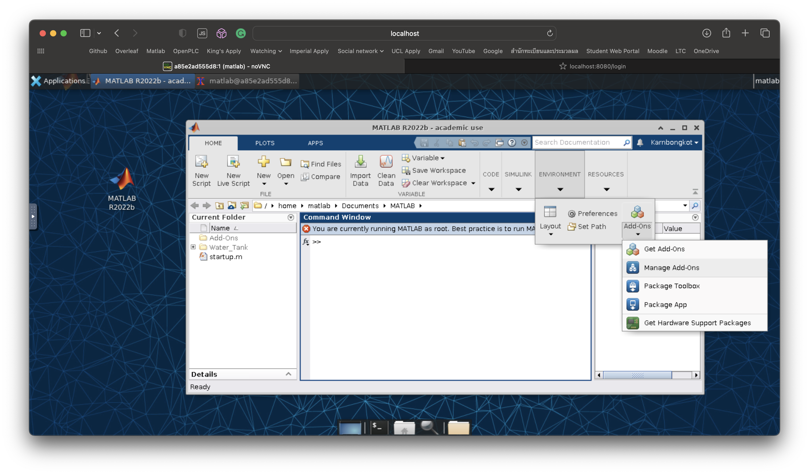
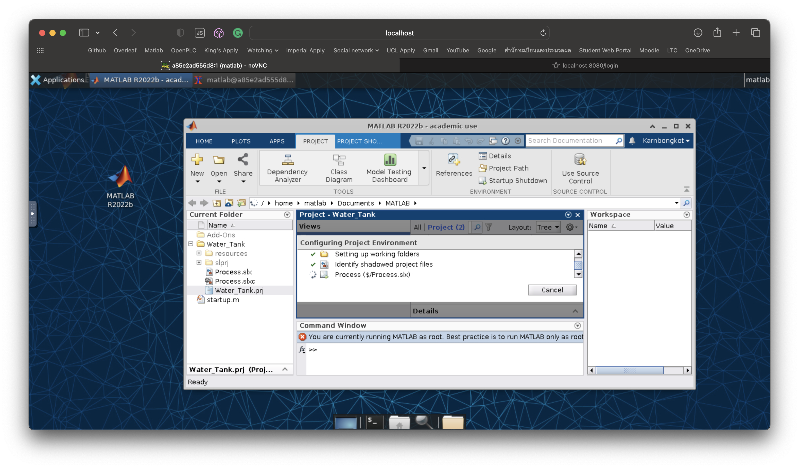
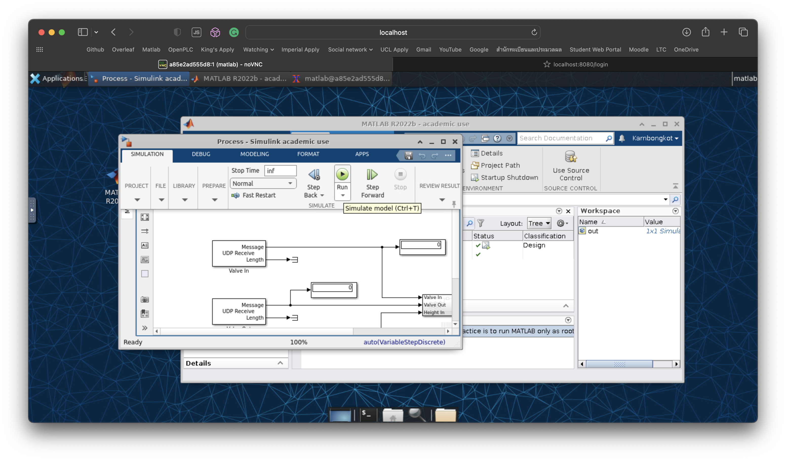

## Step 4: Runing the containers for the first time

All our VMs are ready but we still have some setting up to do with Docker containers. First, to start running everything, start a terminal at the Virtual_testbed directory and command `docker compose up`. Docker will start fulling images and you can just wait.

When the containers are all running, if you have a Docker Desktop, you should see this: 
We can then start setting up each containers.

### The PLC
* Access the OpenPLC webserver on localhost:8080
* Login with username: openplc, password: openplc
* Go to Hardware menu and choose "Simulink with DNP3", save changes.
* Go to Setting and check "Start OpenPLC in RUN mode".
* Go to Programs menu and upload the PLC program, which can be found in Virtual_testbed > Workstation > PLC > Runtime > water_tank_final.st

### The physical process

* Access the Matlab vnc through localhost:6080
* Type command `sudo matlab` in the terminal emulator. 
* You will need to login using your own mathwork account.
* Go to adds-on and install Simulink. 
* The model folder should already be mapped to the container so you will find it on the sidebar. Double click on Water_Tank.prj and wait.  
* Now just press Run. 

### Run everything together and it should work perfectly